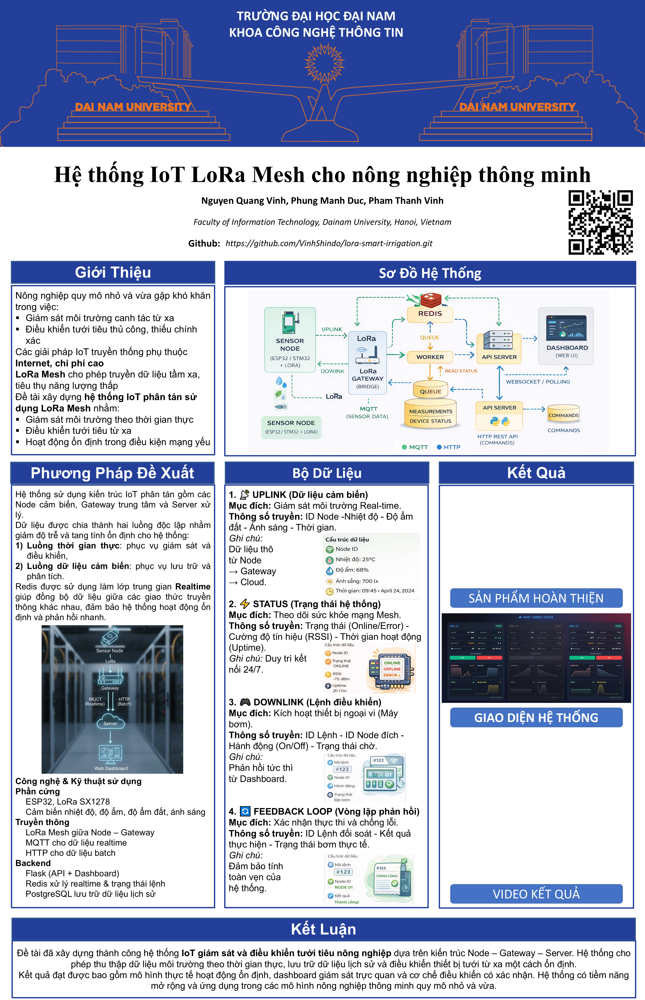
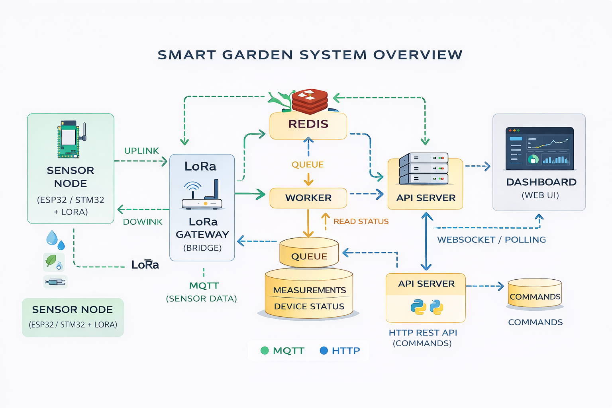
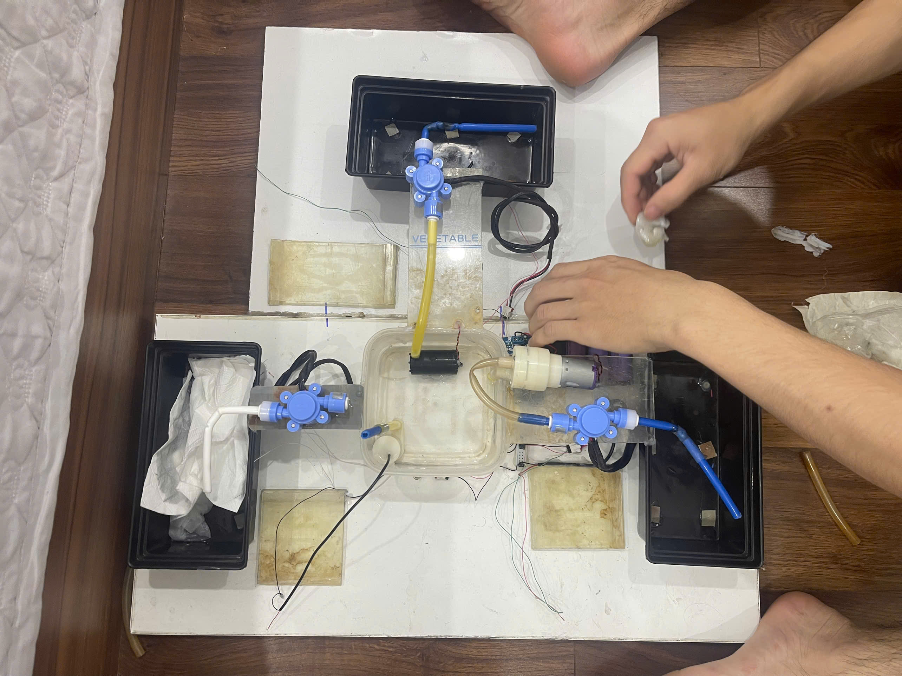

# AgroMesh Smart Irrigation System

AgroMesh Smart Irrigation System là một nền tảng IoT nông nghiệp thông minh sử dụng mạng LoRa Mesh, kiến trúc Gateway – MQTT – Redis – Flask – Database nhằm giám sát môi trường canh tác và điều khiển hệ thống tưới nước từ xa theo thời gian thực.

Dự án tập trung vào các trang trại nhỏ và vừa, nơi yêu cầu hệ thống chi phí thấp, ổn định, có khả năng hoạt động tốt trong môi trường mạng yếu hoặc không có Internet tại các node.

Poster dưới đây tóm tắt toàn bộ hệ thống AgroMesh Smart Irrigation System, bao gồm:
- Mục tiêu
- Kiến trúc
- Luồng dữ liệu
- Kết quả đạt được



---

## 1. Mục tiêu hệ thống

- Thu thập dữ liệu môi trường (nhiệt độ, độ ẩm, ánh sáng, độ ẩm đất) từ nhiều node cảm biến.
- Điều khiển thiết bị tưới (máy bơm) theo:
  - Chế độ tự động dựa trên cảm biến.
  - Chế độ điều khiển từ xa qua giao diện web.
- Đảm bảo **đồng bộ trạng thái thiết bị** thông qua cơ chế feedback loop.
- Tách biệt rõ ràng:
  - Luồng dữ liệu uplink (sensor).
  - Luồng điều khiển downlink (command).
- Sử dụng Redis làm lớp trung gian để xử lý dữ liệu realtime.

---

## 2. Kiến trúc tổng thể
Sơ đồ dưới đây mô tả kiến trúc tổng thể của hệ thống AgroMesh, thể hiện rõ:

- Luồng dữ liệu **uplink** (MQTT – màu mũi tên riêng)
- Luồng điều khiển **downlink** (HTTP/MQTT)
- Vai trò trung gian của Redis trong việc đồng bộ trạng thái

Hệ thống gồm 4 lớp chính:

### 2.1. Node (Thiết bị ngoài đồng)

- ESP32 + LoRa
- Cảm biến: DHT11, cảm biến độ ẩm đất, LDR
- Thiết bị chấp hành: Relay điều khiển bơm
- Chức năng:
  - Đọc cảm biến định kỳ.
  - Gửi dữ liệu uplink lên Gateway.
  - Nhận lệnh downlink (ON/OFF).
  - Thực thi lệnh và gửi phản hồi (ACK).

---

### 2.2. Gateway (Trạm trung gian)

- ESP32 + WiFi + LoRa
- Đóng vai trò cầu nối giữa LoRa và Internet.
- Có **hai luồng xử lý tách biệt**:
  - **Uplink**:
    - Nhận dữ liệu từ Node qua LoRa.
    - Gửi trạng thái realtime lên MQTT.
    - Gom dữ liệu cảm biến và gửi batch lên server qua HTTP.
  - **Downlink**:
    - Nhận lệnh điều khiển từ MQTT.
    - Chuyển lệnh xuống Node qua LoRa.
    - Nhận ACK từ Node và đẩy ngược lại MQTT.

---

### 2.3. Server (Backend)

Backend được tách thành nhiều thành phần:

#### a. Flask App (API + UI)

- Cung cấp Dashboard Web.
- Nhận lệnh điều khiển từ người dùng.
- Gửi lệnh xuống Gateway thông qua MQTT.
- Truy vấn Redis và Database để hiển thị dữ liệu.

#### b. Redis (Realtime Layer)

Redis đóng vai trò **cầu nối giữa các luồng không đồng nhất**:
- Lưu trạng thái realtime của node (status).
- Lưu trạng thái lệnh điều khiển (PENDING → SUCCESS).
- Giúp UI phản hồi nhanh mà không cần truy vấn database.

#### c. MQTT Broker

- Truyền tải dữ liệu realtime:
  - Trạng thái node.
  - Lệnh điều khiển.
  - Phản hồi ACK từ thiết bị.

#### d. Database (Supabase / PostgreSQL)

- Lưu dữ liệu cảm biến lâu dài.
- Phục vụ biểu đồ và thống kê lịch sử.

---

## 3. Luồng dữ liệu hệ thống

### 3.1. Uplink (Sensor Data)

1. Node đọc cảm biến.
2. Gửi dữ liệu qua LoRa.
3. Gateway nhận:
   - Gửi trạng thái realtime qua MQTT.
   - Gom dữ liệu và gửi batch lên Flask qua HTTP.
4. Flask chuyển dữ liệu cho DB Worker.
5. DB Worker lưu dữ liệu vào Database.

---

### 3.2. Downlink (Điều khiển thiết bị)

1. Người dùng nhấn ON/OFF trên Dashboard.
2. UI chuyển trạng thái nút sang **Pending**.
3. Flask:
   - Tạo command ID.
   - Lưu trạng thái PENDING vào Redis.
   - Gửi lệnh xuống MQTT.
4. Gateway nhận MQTT → gửi LoRa xuống Node.

---

### 3.3. Feedback Loop (Xác nhận thực thi)

1. Node nhận lệnh → bật/tắt bơm.
2. Node gửi ACK về Gateway.
3. Gateway publish ACK lên MQTT.
4. Ingestion Worker:
   - Nhận ACK.
   - Cập nhật Redis (SUCCESS).
5. UI:
   - Nhận trạng thái mới.
   - Bỏ pending, cập nhật trạng thái bơm thực tế.

---

## 4. Cấu trúc thư mục
```
agromesh-iot-platform/
├── firmware/
│ ├── esp32_node.ino
│ └── esp32_gateway.ino
├── server/
│ ├── flask_app.py
│ ├── ingestion_worker.py
│ ├── db_worker.py
│ └── templates/
│ └── dashboard.html
├── docs/
│ └── system-diagram.png
├── README.md
└── CONTRIBUTING.md
```

---

## 5. Công nghệ sử dụng

- ESP32, LoRa SX1278
- MQTT (Mosquitto)
- Flask (Python)
- Redis
- Supabase (PostgreSQL)
- HTML, JavaScript, Chart.js

---

## 6. Định hướng phát triển

- Xác thực thiết bị (device authentication).
- Retry command và timeout handling.
- Phân quyền người dùng.
- Mở rộng số lượng node và gateway.

---
## 7. Kết quả đạt được

Hệ thống AgroMesh Smart Irrigation System đã được triển khai và kiểm thử thành công với các kết quả sau:

### 7.1. Mô hình thực tế

- Xây dựng mô hình gồm:
  - 01 Gateway
  - Nhiều Node cảm biến sử dụng LoRa
- Node hoạt động ổn định trong môi trường không có Internet.
- Gateway nhận dữ liệu LoRa và truyền về Server thành công.



---

### 7.2. Giao diện Dashboard giám sát

- Hiển thị realtime:
  - Trạng thái node (ONLINE / OFFLINE)
  - Trạng thái bơm
  - RSSI LoRa
- Biểu đồ:
  - Nhiệt độ
  - Độ ẩm không khí
  - Độ ẩm đất
  - Ánh sáng
- Điều khiển bơm ON/OFF có phản hồi trạng thái (feedback loop).


---

### 7.3. Video demo hệ thống

Video dưới đây minh họa:
- Hoạt động của node ngoài thực tế
- Luồng dữ liệu uplink
- Điều khiển bơm từ Dashboard
- Cơ chế phản hồi ACK

🎥 Video demo:  
👉 https://youtube.com/your-demo-link


---
## 8. Tác giả

Dự án được thực hiện bởi nhóm sinh viên với mục tiêu học tập và nghiên cứu IoT ứng dụng trong nông nghiệp thông minh.
